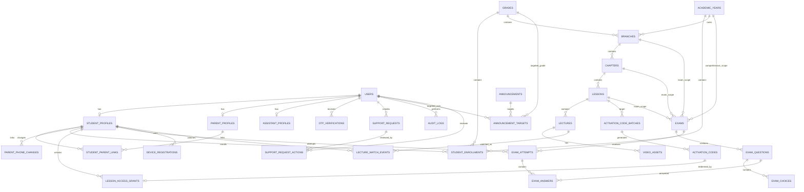

# Backend ERD v1

تصميم أولي لقاعدة البيانات الخاصة بمنصة مدرس لغة عربية واحد، باستخدام Ruby on Rails وMySQL.

الهدف من النسخة دي هو تثبيت العلاقات الأساسية قبل كتابة الـmigrations والـmodels.

## قرارات عامة

- المنصة لمدرس واحد ومادة واحدة، لذلك لا نحتاج حاليًا جدول `teachers` متعدد للمنتج نفسه، لكن سنستخدم جدول `users` وفيه role للمدرس والمساعد والطالب وولي الأمر.
- لا يوجد دفع إلكتروني في نطاق المنتج الحالي؛ الوصول المدفوع يتم حصريًا من خلال أكواد التفعيل، لذلك لا توجد جداول `payments` أو `orders`.
- تسجيل الدخول سيكون برقم الهاتف وكلمة المرور.
- OTP يستخدم للتحقق وقت التسجيل وتغيير رقم ولي الأمر، مع تجهيز طبقة provider مستقلة لاستخدام WhatsApp غالبًا دون ربط قاعدة البيانات بمزود بعينه.
- ولي الأمر يرتبط تلقائيًا بكل طالب سجل نفس رقم ولي الأمر.
- الطالب له حد أقصى 3 أجهزة، وولي الأمر لا يوجد عليه حد أجهزة.
- كود التفعيل يفتح درسًا كاملًا، وأي محاضرة تضاف للدرس لاحقًا تكون مفتوحة لنفس الطالب.
- نتائج السنوات القديمة تتأرشف ولا تختلط بالسنة الحالية.
- الأسئلة في النسخة الأولى اختيار من متعدد فقط، ولا يوجد question bank مستقل.
- الامتحان الشامل يخص صفًا واحدًا داخل سنة دراسية واحدة.
- الإدارة تعرض خيارين للمحتوى: الأرشفة، أو الحذف النهائي. الحذف النهائي يُرفض إذا كان السجل مرتبطًا بنتائج أو محاولات أو أكواد مستخدمة أو صلاحيات وصول أو سجلات مشاهدة؛ في هذه الحالات تكون الأرشفة هي الخيار الوحيد.

## Database Baseline

- MySQL 8 with InnoDB, `utf8mb4`, and `utf8mb4_0900_ai_ci` as the default collation.
- كل الجداول تستخدم `bigint unsigned` للـprimary keys والـforeign keys، مع تطابق النوع والإشارة بين الطرفين.
- كل foreign key له index يبدأ به؛ الـcomposite index يغني عن index منفصل عندما يكون الـFK أول عمود فيه.
- كل الجداول التشغيلية تستخدم Rails timestamps بدقة microseconds.
- أرقام الهاتف تُخزن بعد normalization بصيغة E.164 في عمود `phone_e164`، ولا يُستخدم النص الذي أدخله المستخدم كمفتاح بحث أو uniqueness key.
- القيم المالية غير موجودة في الـschema الحالي. النسب والدرجات تستخدم `decimal` عندما قد تحتوي كسورًا، ولا تستخدم `float`.
- حالات الـworkflow تُخزن كـsmall integer enums في Rails مع validation وقيم ثابتة في الكود. القيم التي تتغير تشغيليًا مثل `permission_key` تبقى strings.
- JSON يستخدم للـsnapshot أو metadata فقط، وليس بدل العلاقات الأساسية التي نحتاج البحث أو الربط عليها.
- كل عمليات الحذف النهائي والخطيرة تتم داخل transaction وتُسجل في `audit_logs`.

## ERD Diagram

## Users And Roles

### users

الحساب الرئيسي لكل أنواع المستخدمين.

| Column | Type | Notes |
|---|---|---|
| id | bigint | PK |
| role | enum/string | teacher, assistant, student, parent |
| name | string | الاسم |
| phone_e164 | string(20) | normalized unique login identifier |
| phone_display | string | nullable, original formatting for display only |
| password_digest | string | Rails has_secure_password |
| status | enum/string | active, suspended, archived |
| phone_verified_at | datetime | بعد OTP |
| last_login_at | datetime | آخر دخول |
| created_at / updated_at | datetime | Rails timestamps |

Indexes:

- unique `phone_e164`
- index `[role, status]`
- index `[status, last_login_at]`

### student_profiles

بيانات الطالب الخاصة.

| Column | Type | Notes |
|---|---|---|
| id | bigint | PK |
| user_id | bigint | FK users |
| birth_date | date | تاريخ الميلاد |
| parent_phone_e164 | string(20) | رقم ولي الأمر بعد normalization |
| governorate | string | اختياري حسب التسجيل الحالي |
| notes | text | ملاحظات داخلية |

Indexes:

- unique `user_id`
- index `parent_phone_e164` لربط ولي الأمر بالطلاب تلقائيًا

### parent_profiles

بيانات ولي الأمر.

| Column | Type | Notes |
|---|---|---|
| id | bigint | PK |
| user_id | bigint | FK users |
| verified_parent_phone_e164 | string(20) | غالبًا نفس users.phone_e164 |

Indexes:

- unique `user_id`
- index `verified_parent_phone_e164`

### student_parent_links

ربط ولي الأمر بالطلاب.

| Column | Type | Notes |
|---|---|---|
| id | bigint | PK |
| student_profile_id | bigint | FK |
| parent_profile_id | bigint | FK |
| relation | string | father, mother, guardian, other |
| linked_at | datetime | وقت الربط |
| status | enum/string | active, removed |

Indexes:

- unique `[student_profile_id, parent_profile_id]`
- index `parent_profile_id`

### parent_phone_changes

تاريخ تغييرات رقم ولي الأمر للطالب. التغيير لا يطبق إلا بعد OTP على الرقم الجديد.

| Column | Type | Notes |
|---|---|---|
| id | bigint | PK |
| student_profile_id | bigint | FK |
| old_phone | string | |
| new_phone | string | |
| requested_by_user_id | bigint | teacher/assistant |
| otp_verification_id | bigint | nullable FK |
| status | enum/string | pending_otp, verified, applied, cancelled |
| applied_at | datetime | بعد التأكيد |
| created_at / updated_at | datetime | |

### assistant_profiles

بيانات المساعد.

| Column | Type | Notes |
|---|---|---|
| id | bigint | PK |
| user_id | bigint | FK users |
| title | string | مثال: خدمة عملاء، محتوى |
| can_login | boolean | تفعيل الحساب |

Indexes:

- unique `user_id`

### assistant_permissions

صلاحيات مخصصة يختارها المدرس لكل مساعد.

| Column | Type | Notes |
|---|---|---|
| id | bigint | PK |
| assistant_profile_id | bigint | FK |
| permission_key | string | مثال: manage_codes |
| enabled | boolean | default true |

Suggested permission keys:

- `manage_students`
- `manage_parent_phone`
- `manage_devices`
- `manage_support_requests`
- `manage_content`
- `upload_videos`
- `manage_exams`
- `manage_codes`
- `manage_announcements`
- `view_reports`
- `manage_academic_years`

Indexes:

- unique `[assistant_profile_id, permission_key]`

## Academic Structure

### academic_years

| Column | Type | Notes |
|---|---|---|
| id | bigint | PK |
| name | string | 2026/2027 |
| starts_on | date | بداية السنة |
| ends_on | date | نهاية السنة |
| status | enum/string | active, archived, draft |
| copied_from_year_id | bigint | nullable self FK |

Indexes:

- unique `name`
- index `[status, starts_on]`

### grades

الثانوي فقط.

| Column | Type | Notes |
|---|---|---|
| id | bigint | PK |
| name | string | أولى ثانوي، ثانية ثانوي، ثالثة ثانوي |
| level | integer | 1, 2, 3 |
| active | boolean | |

Indexes:

- unique `level`
- index `[active, level]`

### student_enrollments

تسجيل الطالب في سنة وصف.

| Column | Type | Notes |
|---|---|---|
| id | bigint | PK |
| student_profile_id | bigint | FK |
| academic_year_id | bigint | FK |
| grade_id | bigint | FK |
| status | enum/string | active, archived, transferred |
| enrolled_at | datetime | |

Indexes:

- unique `[student_profile_id, academic_year_id]`
- index `[academic_year_id, grade_id]`

## Content

### branches

فروع اللغة العربية داخل سنة وصف.

| Column | Type | Notes |
|---|---|---|
| id | bigint | PK |
| academic_year_id | bigint | FK |
| grade_id | bigint | FK |
| title | string | نحو، بلاغة، أدب... |
| position | integer | ترتيب |
| status | enum/string | draft, published, hidden, archived |

### chapters

| Column | Type | Notes |
|---|---|---|
| id | bigint | PK |
| branch_id | bigint | FK |
| title | string | الباب |
| position | integer | |
| status | enum/string | draft, published, hidden, archived |

### lessons

الكود يفتح هذا الجدول، وليس محاضرة واحدة.

| Column | Type | Notes |
|---|---|---|
| id | bigint | PK |
| chapter_id | bigint | FK |
| title | string | الدرس |
| position | integer | |
| is_free | boolean | مجاني لكن يتطلب تسجيل |
| requires_exam_pass | boolean | هل فتحه مشروط بنجاح سابق |
| required_exam_id | bigint | nullable FK exams |
| pass_required_percent | integer | nullable |
| publish_at | datetime | جدولة النشر |
| status | enum/string | draft, scheduled, published, hidden, archived |

### lectures

| Column | Type | Notes |
|---|---|---|
| id | bigint | PK |
| lesson_id | bigint | FK |
| title | string | المحاضرة |
| position | integer | |
| duration_seconds | integer | |
| is_free | boolean | يمكن تركها ترث من الدرس |
| publish_at | datetime | |
| status | enum/string | draft, processing, published, hidden, archived |

### video_assets

ملفات الفيديو والتحويلات.

| Column | Type | Notes |
|---|---|---|
| id | bigint | PK |
| lecture_id | bigint | FK |
| original_file_key | string | path/key في التخزين |
| processing_status | enum/string | uploaded, processing, ready, failed |
| duration_seconds | integer | |
| available_qualities | json | 360, 480, 720 |
| watermark_enabled | boolean | |
| created_by_user_id | bigint | teacher/assistant |

### video_variants

اختياري لكنه أفضل للفيديو الحقيقي.

| Column | Type | Notes |
|---|---|---|
| id | bigint | PK |
| video_asset_id | bigint | FK |
| quality | string | 360p, 480p, 720p |
| file_key | string | storage key |
| status | enum/string | processing, ready, failed |
| size_bytes | bigint | |

### lecture_watch_events

جدول بسيط لتتبع المشاهدة والتحليلات، ومفيد لاحقًا في الحماية وخدمة العملاء.

| Column | Type | Notes |
|---|---|---|
| id | bigint | PK |
| student_profile_id | bigint | FK |
| lecture_id | bigint | FK |
| device_registration_id | bigint | nullable FK |
| started_at | datetime | |
| last_position_seconds | integer | |
| completed_at | datetime | nullable |
| ip_address | string | |
| user_agent | text | |

Indexes:

- index `[student_profile_id, lecture_id]`
- index `[lecture_id, started_at]`

## Codes And Access

### activation_code_batches

| Column | Type | Notes |
|---|---|---|
| id | bigint | PK |
| lesson_id | bigint | FK |
| academic_year_id | bigint | FK |
| grade_id | bigint | FK |
| name | string | اسم الدفعة |
| quantity | integer | |
| expires_on | date | غالبًا نهاية السنة |
| created_by_user_id | bigint | teacher/assistant |
| deleted_at | datetime | soft delete للدفعة |

### activation_codes

| Column | Type | Notes |
|---|---|---|
| id | bigint | PK |
| activation_code_batch_id | bigint | FK |
| code_digest | string(64) | unique keyed hash used for redemption lookup |
| code_ciphertext | text | nullable encrypted value only when later re-export is required |
| status | enum/string | unused, redeemed, disabled, deleted |
| redeemed_by_student_profile_id | bigint | nullable FK |
| redeemed_at | datetime | |
| deleted_at | datetime | للحذف غير المستخدم |

Indexes:

- unique `code_digest`
- index `status`
- index `redeemed_by_student_profile_id`

### lesson_access_grants

يمثل أن الطالب فتح درسًا كاملًا. أي محاضرة مستقبلية داخل الدرس تكون مفتوحة له.

| Column | Type | Notes |
|---|---|---|
| id | bigint | PK |
| student_profile_id | bigint | FK |
| lesson_id | bigint | FK |
| academic_year_id | bigint | FK |
| activation_code_id | bigint | nullable FK |
| source | enum/string | code, free, manual |
| expires_on | date | نهاية السنة |
| status | enum/string | active, expired, revoked |

Indexes:

- unique `[student_profile_id, lesson_id, academic_year_id]`

## Exams

### exams

| Column | Type | Notes |
|---|---|---|
| id | bigint | PK |
| title | string | |
| scope_type | enum/string | lesson, chapter, branch, comprehensive |
| lesson_id | bigint | nullable |
| chapter_id | bigint | nullable |
| branch_id | bigint | nullable |
| academic_year_id | bigint | required; comprehensive exam is scoped by year + grade |
| grade_id | bigint | FK |
| duration_minutes | integer | وقت الاختبار كله |
| max_attempts | integer | default 3 |
| pass_percent | integer | default 50 |
| risk_from_percent | integer | default 50 |
| risk_to_percent | integer | default 60 |
| shuffle_questions | boolean | |
| shuffle_choices | boolean | |
| attempt_form_mode | enum/string | same_exam, random_per_attempt |
| show_result_immediately | boolean | |
| status | enum/string | draft, published, hidden, archived |
| created_by_user_id | bigint | teacher/assistant |

Rule:

- يجب ملء FK واحد فقط حسب `scope_type`.

### exam_questions

| Column | Type | Notes |
|---|---|---|
| id | bigint | PK |
| exam_id | bigint | FK |
| body | text | السؤال |
| explanation | text | شرح الإجابة |
| points | decimal | default 1 |
| position | integer | |

### exam_choices

| Column | Type | Notes |
|---|---|---|
| id | bigint | PK |
| exam_question_id | bigint | FK |
| body | text | الاختيار |
| is_correct | boolean | |
| position | integer | |

### exam_attempts

| Column | Type | Notes |
|---|---|---|
| id | bigint | PK |
| exam_id | bigint | FK |
| student_profile_id | bigint | FK |
| attempt_number | integer | 1..3 أو زيادة بموافقة |
| started_at | datetime | |
| submitted_at | datetime | |
| score_points | decimal | |
| max_points | decimal | |
| percent | decimal | |
| result_status | enum/string | passed, risk, failed |
| status | enum/string | in_progress, submitted, expired |
| question_order | json | عند العشوائية |

Indexes:

- unique `[exam_id, student_profile_id, attempt_number]`
- index `[student_profile_id, submitted_at]`

### exam_answers

| Column | Type | Notes |
|---|---|---|
| id | bigint | PK |
| exam_attempt_id | bigint | FK |
| exam_question_id | bigint | FK |
| selected_choice_id | bigint | nullable FK |
| is_correct | boolean | |
| points_awarded | decimal | |

## Devices And Sessions

### device_registrations

للطلاب فقط.

| Column | Type | Notes |
|---|---|---|
| id | bigint | PK |
| student_profile_id | bigint | FK |
| device_fingerprint_digest | string(64) | keyed hash of the normalized fingerprint |
| device_name | string | |
| browser | string | |
| os | string | |
| ip_address | string | |
| user_agent | text | |
| status | enum/string | active, removed, blocked |
| last_seen_at | datetime | |
| removed_at | datetime | |
| last_self_removed_at | datetime | لحساب 7 أيام |

Indexes:

- unique `[student_profile_id, device_fingerprint_digest]`
- index `[student_profile_id, status]`

### user_sessions

لتنفيذ منع جهازين Online في نفس الوقت للطالب.

| Column | Type | Notes |
|---|---|---|
| id | bigint | PK |
| user_id | bigint | FK users |
| device_registration_id | bigint | nullable FK |
| session_token_digest | string | |
| started_at | datetime | |
| last_seen_at | datetime | |
| ended_at | datetime | |
| status | enum/string | active, ended, revoked |

Rule:

- للطلاب: جلسة واحدة active فقط في نفس الوقت.

## Support Requests

### support_requests

طلبات الطالب أو الإدارة التي تحتاج مراجعة.

| Column | Type | Notes |
|---|---|---|
| id | bigint | PK |
| request_type | enum/string | device_removal, extra_exam_attempt, parent_phone_change |
| requester_user_id | bigint | FK users |
| student_profile_id | bigint | nullable FK |
| status | enum/string | pending, approved, rejected, cancelled |
| reason | text | اختياري |
| payload | json | رقم جديد، exam_id، device_id... |
| created_at / updated_at | datetime | |

### support_request_actions

| Column | Type | Notes |
|---|---|---|
| id | bigint | PK |
| support_request_id | bigint | FK |
| reviewer_user_id | bigint | teacher/assistant |
| action | enum/string | approve, reject, comment |
| note | text | |
| created_at | datetime | |

## OTP

### otp_verifications

| Column | Type | Notes |
|---|---|---|
| id | bigint | PK |
| user_id | bigint | nullable FK |
| phone_e164 | string(20) | normalized destination number |
| purpose | enum/string | student_registration, parent_registration, parent_phone_change |
| code_digest | string | لا نخزن الكود خام |
| status | enum/string | pending, verified, expired, failed |
| expires_at | datetime | |
| verified_at | datetime | |
| attempts_count | integer | |
| metadata | json | أي بيانات مؤقتة |

Indexes:

- index `[phone_e164, purpose, status, created_at]`
- index `[status, expires_at]`

## Announcements

### announcements

| Column | Type | Notes |
|---|---|---|
| id | bigint | PK |
| title | string | |
| body | text | |
| created_by_user_id | bigint | teacher/assistant |
| publish_at | datetime | nullable |
| status | enum/string | draft, published, archived |

### announcement_targets

| Column | Type | Notes |
|---|---|---|
| id | bigint | PK |
| announcement_id | bigint | FK |
| target_type | enum/string | grade, user |
| grade_id | bigint | nullable FK |
| user_id | bigint | nullable FK |

Rule:

- إما grade_id أو user_id حسب target_type.

## Logs And Auditing

### audit_logs

| Column | Type | Notes |
|---|---|---|
| id | bigint | PK |
| actor_user_id | bigint | nullable FK |
| action | string | مثال: change_parent_phone |
| target_type | string | Rails polymorphic style |
| target_id | bigint | |
| metadata | json | التفاصيل |
| ip_address | string | |
| created_at | datetime | |

Important audit actions:

- `assistant_permission_changed`
- `parent_phone_change_requested`
- `parent_phone_changed`
- `device_removed`
- `extra_attempt_approved`
- `teacher_impersonated_student`
- `code_batch_generated`
- `code_deleted`
- `video_uploaded`
- `content_archived`
- `content_hard_deleted`

## Rails Model Notes

Suggested Rails naming:

- `User`
- `StudentProfile`
- `ParentProfile`
- `StudentParentLink`
- `AssistantProfile`
- `AssistantPermission`
- `AcademicYear`
- `Grade`
- `StudentEnrollment`
- `Branch`
- `Chapter`
- `Lesson`
- `Lecture`
- `VideoAsset`
- `VideoVariant`
- `ActivationCodeBatch`
- `ActivationCode`
- `LessonAccessGrant`
- `Exam`
- `ExamQuestion`
- `ExamChoice`
- `ExamAttempt`
- `ExamAnswer`
- `DeviceRegistration`
- `UserSession`
- `SupportRequest`
- `SupportRequestAction`
- `OtpVerification`
- `Announcement`
- `AnnouncementTarget`
- `AuditLog`

## Final Indexing Plan

القائمة التالية هي الحد الأدنى المطلوب في الـmigrations. ترتيب أعمدة الـcomposite indexes مقصود بناءً على مسارات القراءة والـuniqueness، ولا ننشئ indexes منفصلة مكررة تغطيها هذه الـindexes.

### Identity and access

| Table | Index | Purpose |
|---|---|---|
| users | unique `(phone_e164)` | login and identity |
| users | `(role, status)` | administration filters |
| users | `(status, last_login_at)` | active/inactive reports |
| student_profiles | unique `(user_id)` | one-to-one profile |
| student_profiles | `(parent_phone_e164)` | automatic parent linking |
| parent_profiles | unique `(user_id)` | one-to-one profile |
| parent_profiles | `(verified_parent_phone_e164)` | parent lookup |
| assistant_profiles | unique `(user_id)` | one-to-one profile |
| assistant_permissions | unique `(assistant_profile_id, permission_key)` | one permission value per assistant |
| student_parent_links | unique `(student_profile_id, parent_profile_id)` | prevent duplicate links |
| student_parent_links | `(parent_profile_id, status, student_profile_id)` | load active children for a parent |
| otp_verifications | `(phone_e164, purpose, status, created_at)` | latest active OTP lookup |
| otp_verifications | `(status, expires_at)` | expiration cleanup job |

### Academic content

| Table | Index | Purpose |
|---|---|---|
| academic_years | unique `(name)` | prevent duplicate years |
| academic_years | `(status, starts_on)` | current/archive listing |
| grades | unique `(level)` | stable grade identity |
| student_enrollments | unique `(student_profile_id, academic_year_id)` | one grade per student/year |
| student_enrollments | `(academic_year_id, grade_id, status, student_profile_id)` | grade rosters |
| branches | unique `(academic_year_id, grade_id, position)` | stable ordering per grade/year |
| branches | `(academic_year_id, grade_id, status, position)` | published curriculum query |
| chapters | unique `(branch_id, position)` | stable chapter ordering |
| chapters | `(branch_id, status, position)` | published chapter listing |
| lessons | unique `(chapter_id, position)` | stable lesson ordering |
| lessons | `(chapter_id, status, publish_at, position)` | scheduled/published lesson listing |
| lectures | unique `(lesson_id, position)` | stable lecture ordering |
| lectures | `(lesson_id, status, publish_at, position)` | scheduled/published lecture listing |
| video_assets | `(lecture_id, processing_status)` | current lecture media state |
| video_variants | unique `(video_asset_id, quality)` | one variant per quality |

If archived content may reuse the same position, replace the ordering unique indexes with an immutable `position` policy or include an `archived_generation` column. Do not include nullable `deleted_at` in a MySQL unique index expecting PostgreSQL-style partial uniqueness; multiple `NULL` values do not enforce the intended active-row rule.

### Activation and entitlement

| Table | Index | Purpose |
|---|---|---|
| activation_code_batches | `(lesson_id, academic_year_id, grade_id, deleted_at)` | batch management |
| activation_codes | unique `(code_digest)` | secure redemption lookup; never store exportable codes as plaintext after issuance unless product operations require it |
| activation_codes | `(activation_code_batch_id, status, id)` | batch listing/export |
| activation_codes | `(redeemed_by_student_profile_id, redeemed_at)` | student redemption history |
| lesson_access_grants | unique `(student_profile_id, lesson_id, academic_year_id)` | one entitlement per student/lesson/year |
| lesson_access_grants | `(student_profile_id, academic_year_id, status, expires_on)` | active student entitlements |
| lesson_access_grants | `(lesson_id, academic_year_id, status)` | lesson access reports |

Store a keyed hash in `code_digest` for fast exact lookup. If staff must re-export codes later, store encrypted ciphertext separately in `code_ciphertext`; hashing alone is preferred when re-export is not required.

### Exams

| Table | Index | Purpose |
|---|---|---|
| exams | `(academic_year_id, grade_id, status, scope_type)` | exams for one grade/year |
| exams | `(lesson_id, status)` | lesson exams |
| exams | `(chapter_id, status)` | chapter exams |
| exams | `(branch_id, status)` | branch exams |
| exam_questions | unique `(exam_id, position)` | stable question order |
| exam_choices | unique `(exam_question_id, position)` | stable choice order |
| exam_attempts | unique `(exam_id, student_profile_id, attempt_number)` | attempt numbering |
| exam_attempts | `(student_profile_id, submitted_at)` | student history |
| exam_attempts | `(exam_id, status, submitted_at)` | exam reporting and unfinished attempts |
| exam_answers | unique `(exam_attempt_id, exam_question_id)` | one answer per question/attempt |

Database checks for `exams`:

- `grade_id` and `academic_year_id` are always required.
- `scope_type = lesson` requires only `lesson_id` among the scope foreign keys.
- `scope_type = chapter` requires only `chapter_id`.
- `scope_type = branch` requires only `branch_id`.
- `scope_type = comprehensive` requires all three content scope foreign keys to be `NULL`; the exam is identified by its single `academic_year_id + grade_id` pair.
- `pass_percent`, `risk_from_percent`, and `risk_to_percent` are between 0 and 100, with `risk_from_percent <= risk_to_percent`.
- `max_attempts > 0` and `duration_minutes > 0`.

### Sessions, activity, and operations

| Table | Index | Purpose |
|---|---|---|
| device_registrations | unique `(student_profile_id, device_fingerprint_digest)` | device identity |
| device_registrations | `(student_profile_id, status, last_seen_at)` | enforce/list active devices |
| user_sessions | unique `(session_token_digest)` | token authentication |
| user_sessions | `(user_id, status, last_seen_at)` | active-session enforcement |
| user_sessions | `(status, last_seen_at)` | stale-session cleanup |
| lecture_watch_events | `(student_profile_id, lecture_id, started_at)` | student progress/history |
| lecture_watch_events | `(lecture_id, started_at)` | lecture analytics |
| support_requests | `(status, request_type, created_at)` | assistant work queue |
| support_requests | `(requester_user_id, created_at)` | requester history |
| support_requests | `(student_profile_id, status, created_at)` | student support state |
| support_request_actions | `(support_request_id, created_at)` | request timeline |
| announcements | `(status, publish_at)` | scheduled publication |
| announcement_targets | `(target_type, grade_id, announcement_id)` | grade announcements |
| announcement_targets | `(target_type, user_id, announcement_id)` | user announcements |
| audit_logs | `(actor_user_id, created_at)` | actor history |
| audit_logs | `(target_type, target_id, created_at)` | object audit trail |
| audit_logs | `(action, created_at)` | security/operations reports |

## Foreign-Key Delete Policy

- `RESTRICT`: academic content with dependent codes, access grants, exams, attempts, answers, video watch events, or audit-relevant history.
- `CASCADE`: true owned children that have no independent business meaning, such as exam choices when deleting an unused draft question, or support request actions when deleting a request that is legally allowed to be removed.
- `SET NULL`: optional actor references when the historical event must survive account removal, such as `audit_logs.actor_user_id` and selected `created_by_user_id` columns.
- User-facing "delete" defaults to archive/disable. Hard delete runs through a dedicated service that checks dependencies inside a transaction before issuing any delete.

## Data Integrity Rules

- Validate and normalize Egyptian phone numbers into E.164 before persistence.
- Enforce a maximum of three active device registrations for a student inside a transaction with a row lock on the student profile; an index alone cannot enforce this count.
- Enforce one active student session inside a transaction/lock. MySQL does not provide the partial unique index normally used for `WHERE status = active`.
- Redeem activation codes with `SELECT ... FOR UPDATE` so the same code cannot be consumed concurrently.
- Allocate `attempt_number` inside a transaction using the unique attempt index as the final concurrency guard.
- Copy the question and choice order into the attempt snapshot before an exam begins; do not let later exam edits change historical attempts.
- Never update submitted attempts or answers in place. Corrections are explicit audited operations.
- Use UTC for stored timestamps and convert to Africa/Cairo only at the application boundary.
- Archive old academic years and always scope student content, grants, attempts, and reports by `academic_year_id`.

## Migration Order

1. `users`, profiles, assistant permissions, and parent links.
2. academic years, grades, enrollments, and the content hierarchy.
3. video assets and variants.
4. exams, questions, and choices; then add the optional lesson prerequisite foreign key.
5. activation batches, codes, and lesson access grants.
6. attempts and answers.
7. devices, sessions, and watch events.
8. OTP, support requests, announcements, and audit logs.

## Remaining Provider Decision

The database design is provider-neutral. WhatsApp is the preferred OTP channel, but the implementation still needs a final provider choice and credentials. Store delivery attempts in a separate `otp_deliveries` table only if operational delivery tracking, retries, costs, or multiple providers are required; otherwise provider message IDs and failure metadata can remain on `otp_verifications` for v1.
