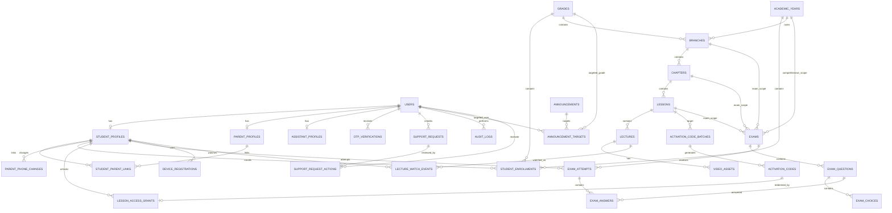

# Backend ERD v1

تصميم أولي لقاعدة البيانات الخاصة بمنصة مدرس لغة عربية واحد، باستخدام Ruby on Rails وMySQL.

الهدف من النسخة دي هو تثبيت العلاقات الأساسية قبل كتابة الـmigrations والـmodels.

## قرارات عامة

- المنصة لمدرس واحد ومادة واحدة، لذلك لا نحتاج حاليًا جدول `teachers` متعدد للمنتج نفسه، لكن سنستخدم جدول `users` وفيه role للمدرس والمساعد والطالب وولي الأمر.
- تسجيل الدخول سيكون برقم الهاتف وكلمة المرور.
- OTP يستخدم للتحقق وقت التسجيل وتغيير رقم ولي الأمر.
- ولي الأمر يرتبط تلقائيًا بكل طالب سجل نفس رقم ولي الأمر.
- الطالب له حد أقصى 3 أجهزة، وولي الأمر لا يوجد عليه حد أجهزة.
- كود التفعيل يفتح درسًا كاملًا، وأي محاضرة تضاف للدرس لاحقًا تكون مفتوحة لنفس الطالب.
- نتائج السنوات القديمة تتأرشف ولا تختلط بالسنة الحالية.
- الأسئلة في النسخة الأولى اختيار من متعدد فقط، ولا يوجد question bank مستقل.

## ERD Diagram

## Users And Roles

### users

الحساب الرئيسي لكل أنواع المستخدمين.

| Column | Type | Notes |
|---|---|---|
| id | bigint | PK |
| role | enum/string | teacher, assistant, student, parent |
| name | string | الاسم |
| phone | string | unique, login identifier |
| password_digest | string | Rails has_secure_password |
| status | enum/string | active, suspended, archived |
| phone_verified_at | datetime | بعد OTP |
| last_login_at | datetime | آخر دخول |
| created_at / updated_at | datetime | Rails timestamps |

Indexes:

- unique `phone`
- index `role`
- index `status`

### student_profiles

بيانات الطالب الخاصة.

| Column | Type | Notes |
|---|---|---|
| id | bigint | PK |
| user_id | bigint | FK users |
| birth_date | date | تاريخ الميلاد |
| parent_phone | string | الرقم الذي يجب أن يسجل به ولي الأمر |
| governorate | string | اختياري حسب التسجيل الحالي |
| notes | text | ملاحظات داخلية |

### parent_profiles

بيانات ولي الأمر.

| Column | Type | Notes |
|---|---|---|
| id | bigint | PK |
| user_id | bigint | FK users |
| verified_parent_phone | string | غالبًا نفس users.phone |

### student_parent_links

ربط ولي الأمر بالطلاب.

| Column | Type | Notes |
|---|---|---|
| id | bigint | PK |
| student_profile_id | bigint | FK |
| parent_profile_id | bigint | FK |
| relation | string | father, mother, guardian, other |
| linked_at | datetime | وقت الربط |
| status | enum/string | active, removed |

Indexes:

- unique `[student_profile_id, parent_profile_id]`
- index `parent_profile_id`

### parent_phone_changes

تاريخ تغييرات رقم ولي الأمر للطالب. التغيير لا يطبق إلا بعد OTP على الرقم الجديد.

| Column | Type | Notes |
|---|---|---|
| id | bigint | PK |
| student_profile_id | bigint | FK |
| old_phone | string | |
| new_phone | string | |
| requested_by_user_id | bigint | teacher/assistant |
| otp_verification_id | bigint | nullable FK |
| status | enum/string | pending_otp, verified, applied, cancelled |
| applied_at | datetime | بعد التأكيد |
| created_at / updated_at | datetime | |

### assistant_profiles

بيانات المساعد.

| Column | Type | Notes |
|---|---|---|
| id | bigint | PK |
| user_id | bigint | FK users |
| title | string | مثال: خدمة عملاء، محتوى |
| can_login | boolean | تفعيل الحساب |

### assistant_permissions

صلاحيات مخصصة يختارها المدرس لكل مساعد.

| Column | Type | Notes |
|---|---|---|
| id | bigint | PK |
| assistant_profile_id | bigint | FK |
| permission_key | string | مثال: manage_codes |
| enabled | boolean | default true |

Suggested permission keys:

- `manage_students`
- `manage_parent_phone`
- `manage_devices`
- `manage_support_requests`
- `manage_content`
- `upload_videos`
- `manage_exams`
- `manage_codes`
- `manage_announcements`
- `view_reports`
- `manage_academic_years`

## Academic Structure

### academic_years

| Column | Type | Notes |
|---|---|---|
| id | bigint | PK |
| name | string | 2026/2027 |
| starts_on | date | بداية السنة |
| ends_on | date | نهاية السنة |
| status | enum/string | active, archived, draft |
| copied_from_year_id | bigint | nullable self FK |

### grades

الثانوي فقط.

| Column | Type | Notes |
|---|---|---|
| id | bigint | PK |
| name | string | أولى ثانوي، ثانية ثانوي، ثالثة ثانوي |
| level | integer | 1, 2, 3 |
| active | boolean | |

### student_enrollments

تسجيل الطالب في سنة وصف.

| Column | Type | Notes |
|---|---|---|
| id | bigint | PK |
| student_profile_id | bigint | FK |
| academic_year_id | bigint | FK |
| grade_id | bigint | FK |
| status | enum/string | active, archived, transferred |
| enrolled_at | datetime | |

Indexes:

- unique `[student_profile_id, academic_year_id]`
- index `[academic_year_id, grade_id]`

## Content

### branches

فروع اللغة العربية داخل سنة وصف.

| Column | Type | Notes |
|---|---|---|
| id | bigint | PK |
| academic_year_id | bigint | FK |
| grade_id | bigint | FK |
| title | string | نحو، بلاغة، أدب... |
| position | integer | ترتيب |
| status | enum/string | draft, published, hidden, archived |

### chapters

| Column | Type | Notes |
|---|---|---|
| id | bigint | PK |
| branch_id | bigint | FK |
| title | string | الباب |
| position | integer | |
| status | enum/string | draft, published, hidden, archived |

### lessons

الكود يفتح هذا الجدول، وليس محاضرة واحدة.

| Column | Type | Notes |
|---|---|---|
| id | bigint | PK |
| chapter_id | bigint | FK |
| title | string | الدرس |
| position | integer | |
| is_free | boolean | مجاني لكن يتطلب تسجيل |
| requires_exam_pass | boolean | هل فتحه مشروط بنجاح سابق |
| required_exam_id | bigint | nullable FK exams |
| pass_required_percent | integer | nullable |
| publish_at | datetime | جدولة النشر |
| status | enum/string | draft, scheduled, published, hidden, archived |

### lectures

| Column | Type | Notes |
|---|---|---|
| id | bigint | PK |
| lesson_id | bigint | FK |
| title | string | المحاضرة |
| position | integer | |
| duration_seconds | integer | |
| is_free | boolean | يمكن تركها ترث من الدرس |
| publish_at | datetime | |
| status | enum/string | draft, processing, published, hidden, archived |

### video_assets

ملفات الفيديو والتحويلات.

| Column | Type | Notes |
|---|---|---|
| id | bigint | PK |
| lecture_id | bigint | FK |
| original_file_key | string | path/key في التخزين |
| processing_status | enum/string | uploaded, processing, ready, failed |
| duration_seconds | integer | |
| available_qualities | json | 360, 480, 720 |
| watermark_enabled | boolean | |
| created_by_user_id | bigint | teacher/assistant |

### video_variants

اختياري لكنه أفضل للفيديو الحقيقي.

| Column | Type | Notes |
|---|---|---|
| id | bigint | PK |
| video_asset_id | bigint | FK |
| quality | string | 360p, 480p, 720p |
| file_key | string | storage key |
| status | enum/string | processing, ready, failed |
| size_bytes | bigint | |

### lecture_watch_events

جدول بسيط لتتبع المشاهدة والتحليلات، ومفيد لاحقًا في الحماية وخدمة العملاء.

| Column | Type | Notes |
|---|---|---|
| id | bigint | PK |
| student_profile_id | bigint | FK |
| lecture_id | bigint | FK |
| device_registration_id | bigint | nullable FK |
| started_at | datetime | |
| last_position_seconds | integer | |
| completed_at | datetime | nullable |
| ip_address | string | |
| user_agent | text | |

Indexes:

- index `[student_profile_id, lecture_id]`
- index `[lecture_id, started_at]`

## Codes And Access

### activation_code_batches

| Column | Type | Notes |
|---|---|---|
| id | bigint | PK |
| lesson_id | bigint | FK |
| academic_year_id | bigint | FK |
| grade_id | bigint | FK |
| name | string | اسم الدفعة |
| quantity | integer | |
| expires_on | date | غالبًا نهاية السنة |
| created_by_user_id | bigint | teacher/assistant |
| deleted_at | datetime | soft delete للدفعة |

### activation_codes

| Column | Type | Notes |
|---|---|---|
| id | bigint | PK |
| activation_code_batch_id | bigint | FK |
| code | string | unique |
| status | enum/string | unused, redeemed, disabled, deleted |
| redeemed_by_student_profile_id | bigint | nullable FK |
| redeemed_at | datetime | |
| deleted_at | datetime | للحذف غير المستخدم |

Indexes:

- unique `code`
- index `status`
- index `redeemed_by_student_profile_id`

### lesson_access_grants

يمثل أن الطالب فتح درسًا كاملًا. أي محاضرة مستقبلية داخل الدرس تكون مفتوحة له.

| Column | Type | Notes |
|---|---|---|
| id | bigint | PK |
| student_profile_id | bigint | FK |
| lesson_id | bigint | FK |
| academic_year_id | bigint | FK |
| activation_code_id | bigint | nullable FK |
| source | enum/string | code, free, manual |
| expires_on | date | نهاية السنة |
| status | enum/string | active, expired, revoked |

Indexes:

- unique `[student_profile_id, lesson_id, academic_year_id]`

## Exams

### exams

| Column | Type | Notes |
|---|---|---|
| id | bigint | PK |
| title | string | |
| scope_type | enum/string | lesson, chapter, branch, comprehensive |
| lesson_id | bigint | nullable |
| chapter_id | bigint | nullable |
| branch_id | bigint | nullable |
| academic_year_id | bigint | nullable for comprehensive |
| grade_id | bigint | FK |
| duration_minutes | integer | وقت الاختبار كله |
| max_attempts | integer | default 3 |
| pass_percent | integer | default 50 |
| risk_from_percent | integer | default 50 |
| risk_to_percent | integer | default 60 |
| shuffle_questions | boolean | |
| shuffle_choices | boolean | |
| attempt_form_mode | enum/string | same_exam, random_per_attempt |
| show_result_immediately | boolean | |
| status | enum/string | draft, published, hidden, archived |
| created_by_user_id | bigint | teacher/assistant |

Rule:

- يجب ملء FK واحد فقط حسب `scope_type`.

### exam_questions

| Column | Type | Notes |
|---|---|---|
| id | bigint | PK |
| exam_id | bigint | FK |
| body | text | السؤال |
| explanation | text | شرح الإجابة |
| points | decimal | default 1 |
| position | integer | |

### exam_choices

| Column | Type | Notes |
|---|---|---|
| id | bigint | PK |
| exam_question_id | bigint | FK |
| body | text | الاختيار |
| is_correct | boolean | |
| position | integer | |

### exam_attempts

| Column | Type | Notes |
|---|---|---|
| id | bigint | PK |
| exam_id | bigint | FK |
| student_profile_id | bigint | FK |
| attempt_number | integer | 1..3 أو زيادة بموافقة |
| started_at | datetime | |
| submitted_at | datetime | |
| score_points | decimal | |
| max_points | decimal | |
| percent | decimal | |
| result_status | enum/string | passed, risk, failed |
| status | enum/string | in_progress, submitted, expired |
| question_order | json | عند العشوائية |

Indexes:

- unique `[exam_id, student_profile_id, attempt_number]`
- index `[student_profile_id, submitted_at]`

### exam_answers

| Column | Type | Notes |
|---|---|---|
| id | bigint | PK |
| exam_attempt_id | bigint | FK |
| exam_question_id | bigint | FK |
| selected_choice_id | bigint | nullable FK |
| is_correct | boolean | |
| points_awarded | decimal | |

## Devices And Sessions

### device_registrations

للطلاب فقط.

| Column | Type | Notes |
|---|---|---|
| id | bigint | PK |
| student_profile_id | bigint | FK |
| device_fingerprint | string | unique-ish |
| device_name | string | |
| browser | string | |
| os | string | |
| ip_address | string | |
| user_agent | text | |
| status | enum/string | active, removed, blocked |
| last_seen_at | datetime | |
| removed_at | datetime | |
| last_self_removed_at | datetime | لحساب 7 أيام |

Indexes:

- unique `[student_profile_id, device_fingerprint]`
- index `[student_profile_id, status]`

### user_sessions

لتنفيذ منع جهازين Online في نفس الوقت للطالب.

| Column | Type | Notes |
|---|---|---|
| id | bigint | PK |
| user_id | bigint | FK users |
| device_registration_id | bigint | nullable FK |
| session_token_digest | string | |
| started_at | datetime | |
| last_seen_at | datetime | |
| ended_at | datetime | |
| status | enum/string | active, ended, revoked |

Rule:

- للطلاب: جلسة واحدة active فقط في نفس الوقت.

## Support Requests

### support_requests

طلبات الطالب أو الإدارة التي تحتاج مراجعة.

| Column | Type | Notes |
|---|---|---|
| id | bigint | PK |
| request_type | enum/string | device_removal, extra_exam_attempt, parent_phone_change |
| requester_user_id | bigint | FK users |
| student_profile_id | bigint | nullable FK |
| status | enum/string | pending, approved, rejected, cancelled |
| reason | text | اختياري |
| payload | json | رقم جديد، exam_id، device_id... |
| created_at / updated_at | datetime | |

### support_request_actions

| Column | Type | Notes |
|---|---|---|
| id | bigint | PK |
| support_request_id | bigint | FK |
| reviewer_user_id | bigint | teacher/assistant |
| action | enum/string | approve, reject, comment |
| note | text | |
| created_at | datetime | |

## OTP

### otp_verifications

| Column | Type | Notes |
|---|---|---|
| id | bigint | PK |
| user_id | bigint | nullable FK |
| phone | string | |
| purpose | enum/string | student_registration, parent_registration, parent_phone_change |
| code_digest | string | لا نخزن الكود خام |
| status | enum/string | pending, verified, expired, failed |
| expires_at | datetime | |
| verified_at | datetime | |
| attempts_count | integer | |
| metadata | json | أي بيانات مؤقتة |

Indexes:

- index `[phone, purpose, status]`

## Announcements

### announcements

| Column | Type | Notes |
|---|---|---|
| id | bigint | PK |
| title | string | |
| body | text | |
| created_by_user_id | bigint | teacher/assistant |
| publish_at | datetime | nullable |
| status | enum/string | draft, published, archived |

### announcement_targets

| Column | Type | Notes |
|---|---|---|
| id | bigint | PK |
| announcement_id | bigint | FK |
| target_type | enum/string | grade, user |
| grade_id | bigint | nullable FK |
| user_id | bigint | nullable FK |

Rule:

- إما grade_id أو user_id حسب target_type.

## Logs And Auditing

### audit_logs

| Column | Type | Notes |
|---|---|---|
| id | bigint | PK |
| actor_user_id | bigint | nullable FK |
| action | string | مثال: change_parent_phone |
| target_type | string | Rails polymorphic style |
| target_id | bigint | |
| metadata | json | التفاصيل |
| ip_address | string | |
| created_at | datetime | |

Important audit actions:

- `assistant_permission_changed`
- `parent_phone_change_requested`
- `parent_phone_changed`
- `device_removed`
- `extra_attempt_approved`
- `teacher_impersonated_student`
- `code_batch_generated`
- `code_deleted`
- `video_uploaded`
- `content_archived`
- `content_hard_deleted`

## Rails Model Notes

Suggested Rails naming:

- `User`
- `StudentProfile`
- `ParentProfile`
- `StudentParentLink`
- `AssistantProfile`
- `AssistantPermission`
- `AcademicYear`
- `Grade`
- `StudentEnrollment`
- `Branch`
- `Chapter`
- `Lesson`
- `Lecture`
- `VideoAsset`
- `VideoVariant`
- `ActivationCodeBatch`
- `ActivationCode`
- `LessonAccessGrant`
- `Exam`
- `ExamQuestion`
- `ExamChoice`
- `ExamAttempt`
- `ExamAnswer`
- `DeviceRegistration`
- `UserSession`
- `SupportRequest`
- `SupportRequestAction`
- `OtpVerification`
- `Announcement`
- `AnnouncementTarget`
- `AuditLog`

## Open Decisions

قبل الـmigrations النهائية نحتاج نثبت هذه النقاط:

- هل نحتاج دفع/مدفوعات لاحقًا؟ حاليًا الأكواد فقط، لذلك لم نضف `payments`.
- هل الامتحان الشامل سيكون مربوطًا بسنة وصف فقط، أم يمكن أن يشمل أكثر من سنة؟
- هل حذف المحتوى النهائي مسموح لو عليه نتائج أو أكواد مستخدمة؟ الأفضل backend يمنع hard delete عند وجود dependencies.
- هل نحتاج تقارير حضور/مشاهدة تفصيلية جدًا؟ أضفنا `lecture_watch_events` كبداية، ويمكن توسيعه لاحقًا.
